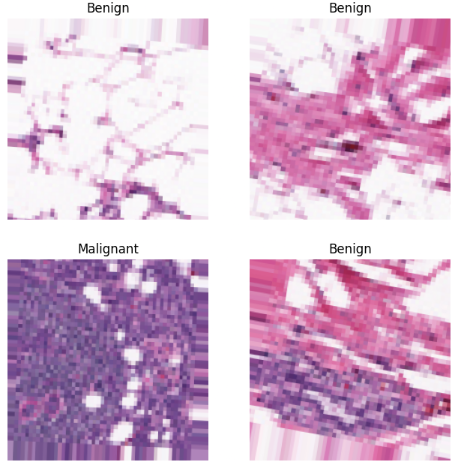

# 🔬 Breast Cancer Detection — CNN Classifier (v2)

CNN-based classification model for breast cancer detection, distinguishing between benign and malignant histopathology images with a focus on maximizing recall to reduce false negatives.

---

## 🧠 Clinical Context

Breast cancer is one of the most common and life-threatening cancers worldwide. Early detection is critical for improving survival rates and enabling timely treatment. Traditional diagnosis relies on manual examination of histopathology images — a process that is time-consuming, subjective, and dependent on clinical expertise.

This project explores how deep learning can assist clinicians by providing automated, scalable classification of breast tissue images, with a deliberate emphasis on **sensitivity (recall)** — because in oncology, a missed malignant case carries far greater cost than a false alarm.

---

## 🎯 Objective

Develop a CNN model to classify breast tissue images as:

* **Benign (0)** — non-cancerous tissue
* **Malignant (1)** — cancerous tissue

**Primary metric: AUC-ROC**, with the operating decision threshold explicitly tuned to prioritize **recall on the malignant class** — minimizing false negatives is the clinical priority. (See *Design Decisions* below for why AUC-ROC replaced raw accuracy as the metric to optimize during training.)

---

## 📷 Sample Histopathology Images
Sample patches from the IDC dataset showing malignant and benign tissue classifications.



---

## 📊 Dataset

|Attribute|Detail|
|-|-|
|Source|Breast Histopathology Images — Kaggle (Paul Mooney)|
|Access method|Kaggle API (`kagglehub`) — fetched directly into the training environment, no manual download|
|Image type|Histopathology patches (50×50px, IDC dataset)|
|Classes|Benign (0), Malignant (1)|
|Input size|Resized to 224×224×3 (EfficientNetB0 native resolution)|
|Full dataset size|~198K patches across ~280 patients|
|Train/val/test split|**Patient-level** stratified split (not image-level) — see note below|
|Challenge|Class imbalance, staining variability, real-world noise|

**Why a patient-level split:** splitting individual image patches at random lets patches from the same patient appear in both train and test. Because patches from one patient are visually correlated (same tissue sample, same staining batch), this leaks information across the split and inflates test performance in a way that wouldn't hold up on a genuinely new patient. This version splits **patient IDs** first, then derives image lists from those groups, so the test set represents entirely unseen patients.

**Citation:**

* Cruz-Roa et al. (2014) — [PubMed](https://www.ncbi.nlm.nih.gov/pubmed/27563488)
* [SPIE Proceedings](http://spie.org/Publications/Proceedings/Paper/10.1117/12.2043872)

---

## 🏗️ Model Architecture

**v2 uses transfer learning** (EfficientNetB0, pretrained on ImageNet) in place of the original custom CNN trained from scratch:

```
Input (224×224×3)
→ Data Augmentation (flip, rotation, zoom)
→ EfficientNet preprocessing (model-specific input scaling)
→ EfficientNetB0 backbone (ImageNet weights)
→ GlobalAveragePooling2D
→ Dropout(0.3)
→ Dense(64, ReLU)
→ Dropout(0.2)
→ Dense(1, Sigmoid)
```

**Two-phase training strategy:**
1. **Phase 1 — feature extraction:** EfficientNetB0 backbone frozen; only the new classification head is trained.
2. **Phase 2 — fine-tuning:** top ~30% of the backbone unfrozen and trained at a much lower learning rate (1e-5), letting higher-level filters adapt to histopathology-specific texture patterns without overwriting the pretrained ImageNet features.

---

## 🔧 Design Decisions (v2 Improvements)

| Improvement | Approach | Rationale |
|---|---|---|
| **Class imbalance** | Class weighting (`sklearn.compute_class_weight`), *not* SMOTE | SMOTE interpolates in feature space, which is appropriate for tabular data. Applied to raw pixels, it blends two histopathology images into a blurred, non-physical hybrid that doesn't resemble real tissue. Class weighting penalizes the loss for minority-class errors without synthesizing implausible images. |
| **Transfer learning** | EfficientNetB0, two-phase (frozen → fine-tune) | More label-efficient than training a CNN from scratch, especially valuable given the class imbalance and the cost of mislabeling malignant tissue. |
| **Data augmentation** | Random horizontal/vertical flip, rotation (±10%), zoom (±10%) | Expands effective diversity of the (especially minority-class) training data without needing more labeled images. |
| **Threshold tuning** | Selected via precision-recall curve to guarantee ≥90% recall on malignant cases, maximizing precision among thresholds meeting that bar | The default 0.5 threshold has no clinical meaning — it's just the sigmoid midpoint. The chosen threshold reflects the actual clinical cost asymmetry (missed cancer vs. false alarm). |
| **Evaluation metric** | AUC-ROC as primary metric (`EarlyStopping(monitor='val_auc')`), not accuracy | Accuracy can look artificially strong on an imbalanced dataset by defaulting to the majority class — exactly the failure mode in the v1 baseline below. AUC-ROC is threshold-independent and a more honest signal of discriminative ability. |

---

## 📈 Results

### v1 Baseline (custom CNN, small sample, no imbalance handling)

|Metric|Benign (0)|Malignant (1)|
|-|-|-|
|Precision|0.48|0.50|
|Recall|0.84|0.15|
|F1-Score|0.61|0.23|
|**Accuracy**||**0.48**|

**Diagnosis:** high recall for benign, very low recall for malignant — the model was defaulting to the majority class, and the ~1,200-image sample was too small and imbalanced to learn discriminative malignant features.

### v2 (EfficientNetB0, patient-level split, threshold-tuned)

|Metric|Benign (0)|Malignant (1)|
|-|-|-|
|Precision|0.89|0.72|
|Recall|0.70|**0.90**|
|F1-Score|0.78|0.80|
|**Accuracy**|| **0.79**|

**Confusion Matrix (at tuned threshold):**

```
              Predicted
              Benign  Malignant
Actual Benign  [3276    1401]
       Malignant [403    3637]
```

**Diagnosis:** malignant recall improved from **0.15 → 0.90** — the model now catches 90% of actual
malignant cases, versus missing 85% of them in the v1 baseline. The tradeoff is a drop in malignant
precision (0.72), meaning roughly 3 in 10 cases flagged as malignant are actually benign — a
deliberate, threshold-tuned choice given that a missed cancer case is far more costly than a false
alarm in this clinical context.

---

## 🔍 Observations & Analysis

**The headline result:** malignant recall improved from **0.15 → 0.90** — the model went from missing
roughly 85% of actual malignant cases to catching 90% of them. This is the direct payoff of the
compounding changes below, not any single one of them in isolation.

**What drove the improvement:**
1. **More, better data** — the full Kaggle dataset instead of a ~1,200-image sample
2. **Patient-level splitting** — no leaked information inflating the test score (see Dataset section above)
3. **Class weighting** — the loss function penalizes missed malignant cases roughly 2.6x more
4. **Transfer learning** — EfficientNetB0's pretrained features, fine-tuned on this task
5. **Threshold tuning** — the operating point (0.448) was chosen deliberately, not left at the default 0.5

**Reading the confusion matrix honestly:**
```
              Predicted
              Benign  Malignant
Actual Benign  [3276    1401]
       Malignant [403    3637]
```
- 403 malignant cases still missed (10%) — down from ~85% missed in the baseline.
- 1,401 benign cases flagged as malignant — the direct cost of the recall-first threshold choice.
  In a real clinical workflow, this is the volume of cases that would need a second (human) review,
  not a false diagnosis outright.

**Why threshold 0.448, not 0.5 or the precision/recall crossover point (~0.6):** the threshold was
chosen as the *lowest* value that still guarantees recall ≥ 0.90, deliberately trading precision
(0.722) for recall — a direct reflection of the clinical priority that a missed cancer case is far
more costly than a false alarm.

**Framed for an interview:** this isn't "the model got 79% accuracy." It's "the model was tuned to
minimize missed malignant cases, at a known and deliberately chosen cost in false positives, using a
patient-level split so the result generalizes to genuinely unseen patients."


* [x] Address class imbalance via class weighting
* [x] Implement transfer learning (EfficientNetB0) for stronger feature extraction
* [x] Add data augmentation (rotation, flipping, zoom) to improve generalization
* [x] Tune decision threshold to optimize recall for malignant class
* [x] Evaluate with AUC-ROC as primary metric
* [x] Patient-level train/val/test split to prevent data leakage
* [x] Data acquisition via Kaggle API (no manual download step)
* [x] Populate v2 results table above with actual run output
* [ ] Consider ensembling EfficientNetB0 with a second backbone (e.g. ResNet50) if further recall gains are needed

---

## 🛠️ Tech Stack

|Tool|Purpose|
|-|-|
|Python 3.x|Core language|
|TensorFlow / Keras|Model development, EfficientNetB0 transfer learning|
|kagglehub|Kaggle API dataset access (no manual download)|
|NumPy / Pandas|Data processing|
|Matplotlib / Seaborn|Visualization|
|Google Colab|Training environment (GPU)|
|scikit-learn|Class weighting, evaluation metrics, threshold tuning|

---

## 📁 Repository Structure

```
breast-cancer-detection-cnn/
├── notebooks/          # Jupyter notebooks (EDA, training, evaluation)
│   └── breast_cancer_cnn_v2.ipynb
├── src/                # Python scripts
│   └── app.py
├── requirements.txt    # Dependencies
└── README.md
```

---

## 🚀 Getting Started

```bash
# Clone the repo
git clone https://github.com/mfebus/breast-cancer-detection-cnn.git
cd breast-cancer-detection-cnn

# Install dependencies
pip install -r requirements.txt

# Open the notebook in Google Colab, or any local Jupyter environment
```

**Works in Colab or locally.** The notebook detects its environment automatically and adjusts —
no manual edits needed either way.

**Dataset access:** no manual download required either way — the notebook fetches the dataset
directly from Kaggle via the API on first run.

**If using Google Colab:**
1. Create a Kaggle API token at [kaggle.com/settings](https://www.kaggle.com/settings) → **API** → **Create New Token**.
2. In Colab, add `KAGGLE_USERNAME` and `KAGGLE_KEY` as **Secrets** (🔑 icon, left sidebar).

That's it — every subsequent run authenticates automatically. Trained models save to your Google Drive.

**If running locally (Jupyter, VS Code, etc.):**
1. Create a Kaggle API token the same way as above.
2. Either set them as environment variables before launching Jupyter:
   ```bash
   export KAGGLE_USERNAME=your_username
   export KAGGLE_KEY=your_key
   ```
   or place the downloaded `kaggle.json` at `~/.kaggle/kaggle.json`.

`kagglehub` checks environment variables first, then `~/.kaggle/kaggle.json`, and falls back to an
interactive login prompt if neither is found. Trained models save to a local `breast_cancer_project/`
folder created next to the notebook.

---

## 👩‍💻 Author

**Maria Febus**
Master of Applied Data Science — University of Michigan (2026)
Transitioning from Pharma R&D Project Management to Healthcare Data Science

---
